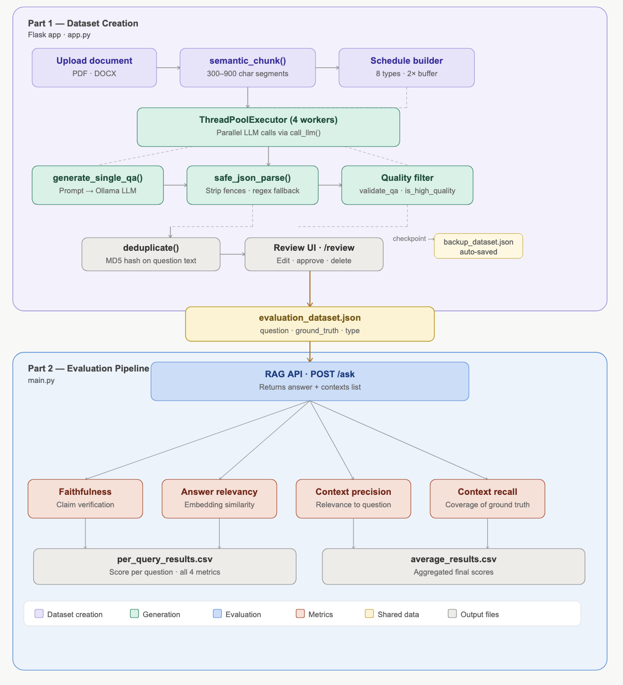
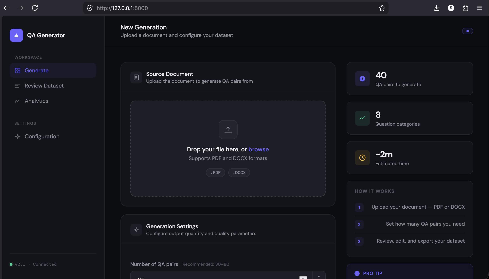
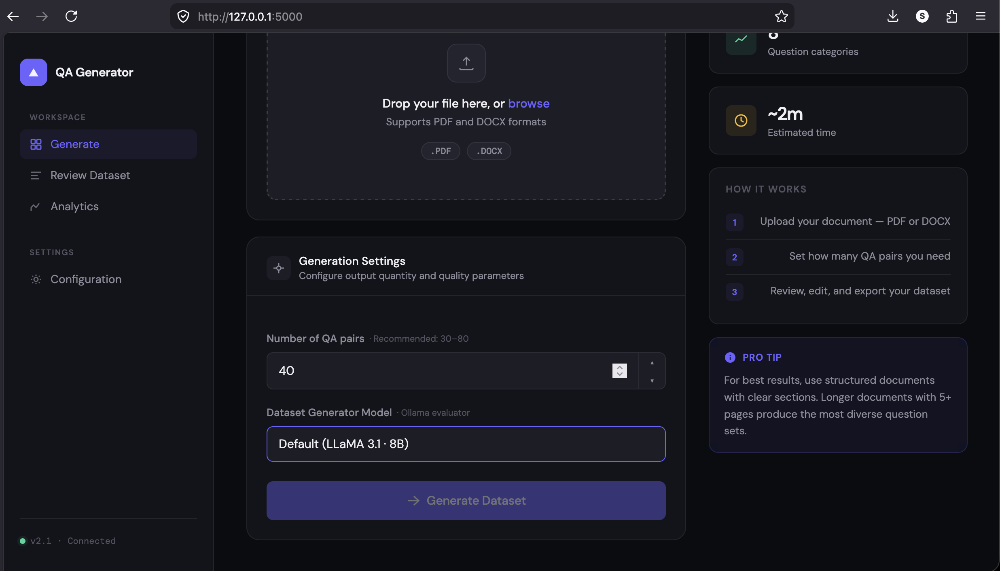
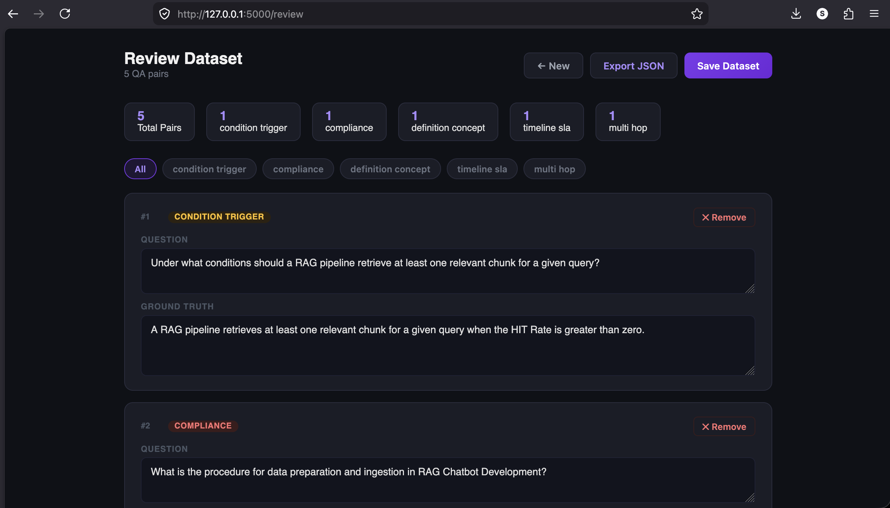
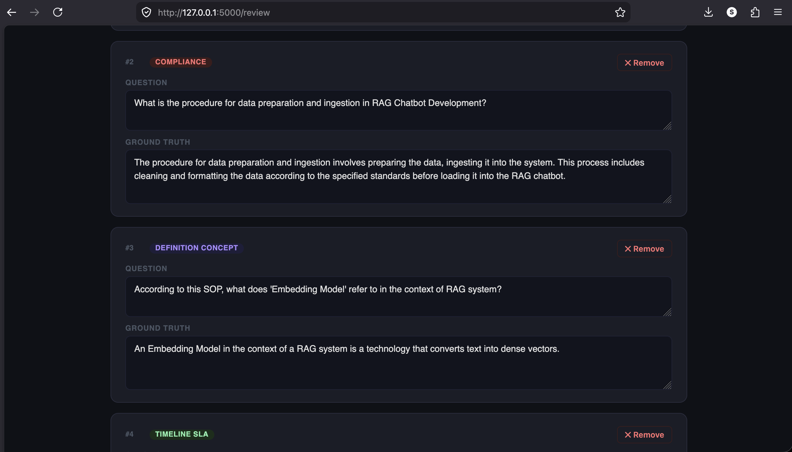
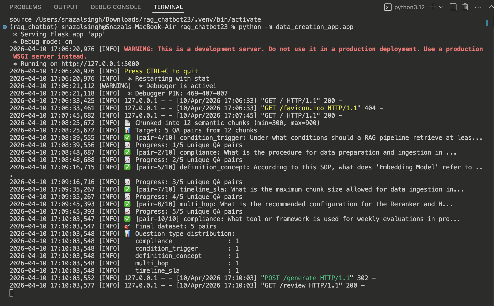
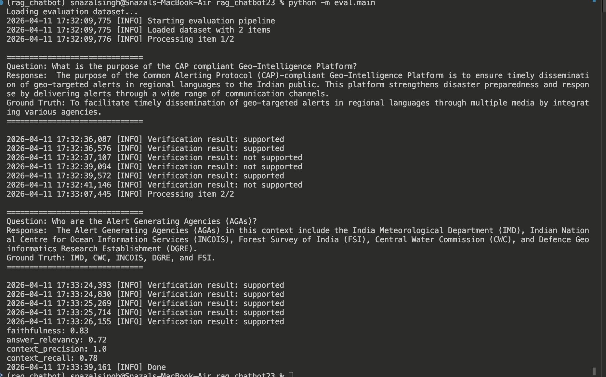

# RAG Evaluation Pipeline

> A lightweight, modular evaluation framework for Retrieval-Augmented Generation (RAG) systems. This pipeline measures the quality of a RAG API across four key metrics and includes a web-based dataset creation tool for generating high-quality evaluation datasets from documents using a local LLM.

---

## Metrics at a Glance

| Metric | Description |
|---|---|
| **Faithfulness** | Claims supported by retrieved context |
| **Answer Relevancy** | Semantic match between question and answer |
| **Context Precision** | Relevance of retrieved contexts |
| **Context Recall** | Coverage of ground truth by contexts |

---

## How It Works

The system operates as a two-stage end-to-end pipeline:

**Step 1 — Create:** Upload a PDF or DOCX document through the web UI. A local LLM generates a balanced, high-quality Q&A evaluation dataset across 8 question types.

**Step 2 — Evaluate:** Run the evaluation pipeline against your live RAG API. It loads the generated dataset, retrieves answers and contexts, and scores across four metrics.



---

## Table of Contents

- [Project Structure](#project-structure)
- [Prerequisites](#prerequisites)
- [Installation](#installation)
- [Configuration](#configuration)
- [Part 1: Dataset Creation (Flask App)](#part-1-dataset-creation-flask-app)
  - [Starting the App](#starting-the-app)
  - [Workflow](#workflow)
  - [Question Types](#question-types)
  - [Generation Pipeline](#generation-pipeline)
  - [Web UI Routes](#web-ui-routes)
  - [Quality Control](#quality-control)
- [Part 2: Evaluation Pipeline](#part-2-evaluation-pipeline)
  - [Metrics](#metrics)
  - [Usage](#usage)
  - [Output Files](#output-files)
- [API Reference](#api-reference)
- [Notes & Limitations](#notes--limitations)

---

## Project Structure

```
.
├── data_creation_app/
│   ├── app.py              # Flask app — dataset generation & review UI
│   ├── llm_service.py      # LLM call abstraction with retry + backoff
│   ├── config.py           # Loads API_URL and MODEL_NAME from .env
│   └── templates/
│       ├── index.html      # Upload form
│       └── review.html     # Dataset review & edit UI
│
├── eval/
│   ├── config.py           # Eval-side config (API_URL, MODEL_NAME)
│   ├── embeddings.py       # BGE-M3 embedding wrapper (via Ollama)
│   ├── llm_service.py      # LLM calls for metric computation
│   ├── utils.py            # Claim extraction, other utilities
│   ├── main.py             # Evaluation pipeline entry point
│   ├── evaluation_dataset.json   # Final dataset saved by web app
│   └── metrics/
│       ├── faithfulness.py
│       ├── context_precision.py
│       ├── context_recall.py
│       └── answer_relevancy.py
│
├── backup_dataset.json     # Auto-checkpoint during generation
├── per_query_results.csv   # Output: per-question scores
├── average_results.csv     # Output: averaged scores
├── assets/                 # Screenshots used in this README
│   ├── architecture.png
│   ├── qa_generator_main.png
│   ├── qa_generator_settings.png
│   ├── review_ui_1.png
│   ├── review_ui_2.png
│   ├── terminal_generation.png
│   └── terminal_eval.png
├── .env                    # Environment variables (not committed)
└── README.md
```

---

## Prerequisites

- Python 3.9+
- [Ollama](https://ollama.com/) running locally with:
  - An LLM model (e.g., `mistral`, `llama3`) for generation and judging
  - `bge-m3:latest` for embeddings (evaluation pipeline only)
- Your RAG API running at `http://127.0.0.1:8000` with a `POST /ask` endpoint

---

## Installation

```bash
# 1. Clone the repository
git clone <your-repo-url>
cd <repo-folder>

# 2. Create and activate a virtual environment
python -m venv venv
source venv/bin/activate    # Windows: venv\Scripts\activate

# 3. Install dependencies
pip install -r requirements.txt
```

**Required packages (`requirements.txt`):**

```
flask
requests
numpy
pypdf
python-docx
python-dotenv
```

---

## Configuration

Create a `.env` file in the project root:

```env
# Ollama chat completions endpoint
API_URL=http://localhost:11434/api/chat

# Ollama model for generation and evaluation judging
MODEL_NAME=mistral
```

> ⚠️ **Warning:** Both `data_creation_app/config.py` and `eval/config.py` load from this same `.env` file. Never commit it to version control.

---

## Part 1: Dataset Creation (Flask App)

### Starting the App

```bash
python -m data_creation_app.app

# Visit http://localhost:5000 in your browser
```





### Workflow

1. Upload a PDF or DOCX document and set the number of Q&A pairs to generate
2. **Generate** — the app chunks the document, schedules generation across all question types, and runs parallel LLM calls
3. **Review** — inspect, edit, or delete generated pairs via the review UI
4. **Save** — approved pairs are written to `eval/evaluation_dataset.json`, ready for evaluation

### Question Types

The app generates questions balanced across 8 specific types:

| Type | Description |
|---|---|
| `procedural` | Step-by-step process questions (how to perform a task) |
| `compliance` | Rules, prohibitions, and mandatory requirements |
| `role_responsibility` | Who owns or must perform a specific action |
| `condition_trigger` | When or under what conditions a process activates |
| `definition_concept` | What a term, acronym, or concept means in the document |
| `exception_escalation` | Edge cases, deviations, and escalation procedures |
| `timeline_sla` | Timeframes, deadlines, response times, and SLAs |
| `multi_hop` | Complex questions requiring synthesis of 2+ facts from the text |





### Generation Pipeline

**Chunking**
`semantic_chunk()` splits on paragraph/section boundaries rather than blind character slicing. Each chunk is 300–900 characters.

**Scheduling**
`build_generation_schedule()` distributes question types evenly across all chunks. A 2× buffer is generated (e.g., 40 attempts for 20 target pairs) to absorb rejections.

**Parallel Execution**
`ThreadPoolExecutor` with 4 workers runs LLM calls concurrently for speed.

**Checkpoint Saving**
Every accepted pair is immediately written to `backup_dataset.json` so no progress is lost on failure.

**Deduplication**
MD5-based hash deduplication on question text prevents near-identical questions from appearing in the final dataset.



### Web UI Routes

| Route | Method | Description |
|---|---|---|
| `/` | `GET` | Upload form (file + pair count + model selector) |
| `/generate` | `POST` | Runs generation pipeline, redirects to `/review` |
| `/review` | `GET` | Dataset review and editing UI |
| `/save` | `POST` | Saves approved dataset to `eval/evaluation_dataset.json` |
| `/stats` | `GET` | Returns JSON summary (type distribution, avg lengths) |

### Quality Control

Every generated Q&A pair passes through two validation stages before being accepted:

**`validate_qa()` — Structural checks:**
- All three keys present: `question`, `ground_truth`, `type`
- Question is at least 15 characters
- Answer is at least 12 words
- Type is one of the 8 defined SOP types

**`is_high_quality()` — Content quality checks:**
- Answer does not contain document-referencing phrases (e.g., "refer to section", "as mentioned")
- Question is not a vague document-meta question (e.g., "what is the document about")
- Question is not a yes/no question
- Answer is not a near-repetition of the question (word overlap threshold: 80%)

---

## Part 2: Evaluation Pipeline

### Metrics

All scores are in the range `[0.0, 1.0]`. Higher is better.

| Metric | Description |
|---|---|
| **Faithfulness** | Whether the answer's claims are supported by the retrieved contexts |
| **Answer Relevancy** | Semantic similarity between the question and the answer (via embeddings) |
| **Context Precision** | How relevant the retrieved contexts are to the question |
| **Context Recall** | How well the retrieved contexts cover the ground truth answer |

### Usage

**1. Ensure Ollama is running**

```bash
ollama serve
```

**2. Start your RAG API**

```bash
uvicorn your_rag_app:app --host 127.0.0.1 --port 8000
```

The RAG API must accept `POST /ask` with body `{"question": "..."}` and return:

```json
{
  "answer": "...",
  "contexts": ["chunk 1", "chunk 2", "..."]
}
```

**3. Run evaluation**

```bash
python -m eval.main
```



**Sample output:**

```
faithfulness: 0.83
answer_relevancy: 0.72
context_precision: 1.0
context_recall: 0.78
```

> 📋 **Sample run** on a Geo-Intelligence Platform SOP document: faithfulness `0.83` · answer_relevancy `0.72` · context_precision `1.0` · context_recall `0.78`

### Output Files

**`per_query_results.csv`** — one row per question:

| question | response | ground_truth | context | faithfulness | answer_relevancy | context_precision | context_recall |
|---|---|---|---|---|---|---|---|

**`average_results.csv`** — aggregated scores:

| avg_faithfulness | avg_answer_relevancy | avg_context_precision | avg_context_recall |
|---|---|---|---|

---

## API Reference

### `GET /stats` — Response Schema

```json
{
  "total": 20,
  "type_distribution": {
    "procedural": 3,
    "compliance": 3,
    "role_responsibility": 2,
    "condition_trigger": 3,
    "definition_concept": 2,
    "exception_escalation": 3,
    "timeline_sla": 2,
    "multi_hop": 2
  },
  "avg_question_len": 14.2,
  "avg_answer_len": 38.7
}
```

---

## Notes & Limitations

- The dataset creation app uses a local Ollama LLM — generation speed depends on your hardware
- The evaluation pipeline makes multiple LLM calls per Q&A pair; larger datasets take proportionally longer
- `bge-m3:latest` embeddings are required for Answer Relevancy scoring — ensure the model is pulled in Ollama
- The `.env` file is intentionally excluded from version control; never commit API credentials
- For best results, use structured documents with clear section headings; documents with 5+ pages produce more diverse question sets
- The generation pipeline runs a 2× buffer to ensure enough high-quality pairs survive the validation filters
